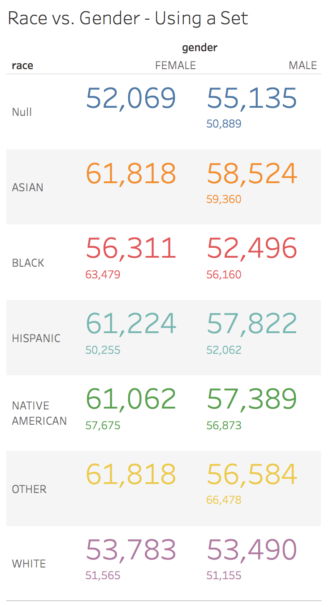
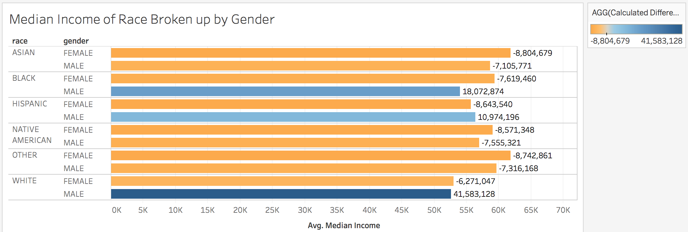
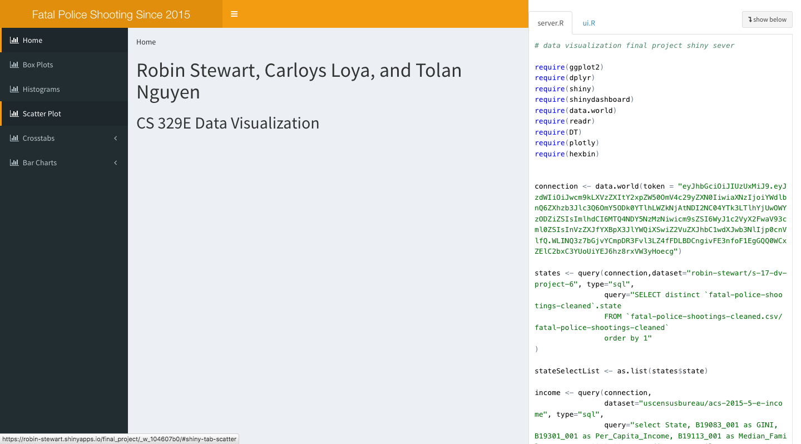

```{r setup, include=FALSE}
sessionInfo()
source('../01 Data/finalplots.R')
knitr::opts_chunk$set(echo=TRUE)
```

#**Introduction**

Police shootings has been in the nightly news for as long as TV has existed, yet each new shooting brings everyone to shilling realizations. This study aims to shed some light on such dark themes and equip people with the facts. 

This data is a list of fatal police shootings from 2015 as recorded by the Washington Post that details the deaths of United States citizens at the hands of police officers. It includes information of the names of the citizens, the manner of death, if the citizen was armed, age, gender, city, and date.

Due to the personal nature of loss, the research team omitted the names of the deceased out of respect.  

#**R Configuration**
Below we display our sessionInfo() for replication purposes.

```{r sessionInfo}
sessionInfo(package=NULL)
```

#**Obtaining The Data Set**

The data set was originally found on data.world, uploaded by a user named carlvlewis who claims that the data set is updated daily. For the purpose of this study we used the latest verison of the data that was available.

The data that was originally obtained was raw and contained private information regarding real people, so the data was cleaned using the lapply and gsub functions. The team removed the names of the deceased and made the race variable clearer. This cleaned data set was upload to the project data set on data.world.

To obtain a copy of this data follow the following steps.

1. Copy and paste the following link into your prefered web browser: https://data.world/robin-stewart/s-17-dv-project-6
    i. At the top-right section of your screen is a blue download button, that when clicked will download a zip file of the data set.
    ii. Alternatively, scroll down to see a sample of the csv dataset. Click on the download button located to the right of the Explore button to download a csv file of the data set.


The following is a summary of the cleaned data set:

```{r}
summary(fatalPoliceShootings)
```  

#**Census Data**

The U.S. Census Bureau and data.world have recently anounced a partnership which has resulted in data.world being host of the Census Bureau's biggest annual household survey, the American Community Suvery.

Through the official US Census Buearu data.world profile, census data will be offered for any person to use and analyze: https://data.world/uscensusbureau

We used a 2011-2015 Income of US Population Estimates data for this particular study. This dataset was found here: https://data.world/uscensusbureau/acs-2015-5-e-income

Using the data.world R package, the 2011-2015 Income of US Population dataset and the Fatal Police Shootings were queried and pulled into RStudio and combined using dplyr. 

Here is a summary of the combined dataset:

```{r}
summary(incomeOfTheFatallyShot)
```  

The columns of GINI, Per_Capita_Income, Median_Family_Income, and Median_Non_Family_Income were added from the census data and matched on state of the individual shot. This dataset was saved as a CSV for later use in Tablaeu and R Markdown.


#**Tablaeu Visualizations**

To create interesting visualizations, we must first understand what the combined data means. The columns that were queried from data.world were GINI, Per_Capita_Income, Median_Family_Income, and Median_Non_Family_Income. These are state-level summaries, meaning that each fatal shootings has per capita income, median family income, median non-family income information based on the state in which the shooting took place. Although this mixes individualized data with general data, it sheds some light into the type of environment and socioeconomic context the shooting took place.


This is a graph of gender of the individual shot vs if that individual showed signs of mental illness. The graph was then colored based on whether that particular individual was shot in area which had high/medium/low per capita income. 




This graph shows the race of the individual shot against the individual's gender. Each cell has the median income colored by race. A set was created by filtering those individuals that were shot in a state who median family income was between 46,000 and 62,000. 


This last Tablaeu visualization was created using the calculated fields of Median(MedianFamilyIncome/PerCapitaIncome) and plotting based on how the individual fled against the race of the individual shot.



The Median Income of Race Broken up by Gender is shown above. This combines both our data set and the census data set through the variables of race, gender and Median Income respectively. Mutliple rows are used used to break down the race into genders for each field. A calculated table parameter is used specifically the avg_median_income - window_avg_income. This parameter is the color in addition to the text and helps show that the males have relatively high numbers for this parameter even though they may have relatively low avg_median_income on it's own compared to the females. 


This is a barhart depicting income of how people are fleeing, separated by signs of mental illness. The line shows the average of median incomes by mental illness and feeling type.


This barchart shows the GINI inequality index of the area criminals are from, using ID-sets to separate high income criminals.


#**R Visualizations**

The following are visualizations created using ggplot2 and dplyr in R Studio. They are based off of the above Tablaeu graphs. 


```{r}
  plot(capitaRangePlot)
```  
This is a graph of gender of the individual shot against if that individual showed signs of mental illness. Each quadrant is separated into 3 numbers that correspond to low/medium/high per capita income, respectively.


```{r}
  plot(genderRacePlot)
```  

This graph shows the race of the individual shot against the individual's gender. A set was created by using the dplyr filter function to separate those individuals that were shot in a state who's state had a median family income was between 46,000 and 62,000. 


```{r}
  plot(raceFleePlot)
```  
This R visualization was created using the calculated fields of Median(MedianFamilyIncome/PerCapitaIncome) and plotting based on how the individual fled against the race of the individual shot. 


```{r}
  plot(incomeByRacePlot)
```  

The Median Income of Race Broken up by Gender is shown above, specifically the R version. This combines both our data set and the census data set through the variables of race, gender and Median Income respectively. A facet is used to break down the race into genders for each field. A calculated table parameter is used specifically the avg_median_income - window_avg_income. This parameter text helps show that the males have relatively high numbers for this parameter even though they may have relatively low avg_median_income on it's own compared to the females. The numbers are slightly different due to limits on the SQL statement so the process does not take to long to pull the data.  


```{r}
  plot(fleePlot)
```  
This is a barhart depicting income of how people are fleeing, separated by signs of mental illness. The line shows the average of median incomes by mental illness and feeling type.


```{r}
  plot(inequalityPlot)
```  

This barchart shows the GINI inequality index of the area criminals are from, using ID-sets to separate high income criminals.


#**R Shiny**
All R visualizations were graphed on crosstabs in R Shiny. Each graph in each of the different tabs.
Here is a link to the published shiny application: https://carlosloya.shinyapps.io/dvproject6shinyapplication/


